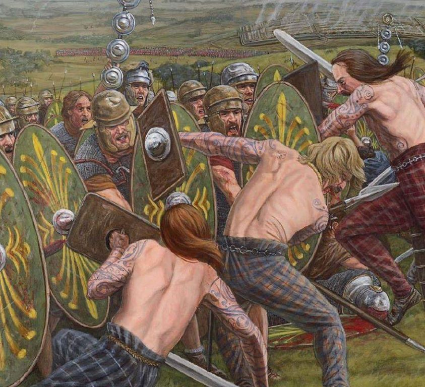

# ⚔ Intelligent Formation Simulation Language (IFSL) ⚔

## Indice:

1. [Idea General](#div-classheader1⚔-idea-generaldiv)

2. [Mundo Simulado](#div-classheader1⚔-mundo-simuladodiv)

3. [Unidades de ejercito](#div-classheader1⚔-unidades-de-ejercitodiv)

4. [Resumiendo y formalizando](#div-classheader1⚔-resumiendo-y-formalizandodiv)

## 
⚔ Idea General

&nbsp; Este proyecto tiene como objetivo principal tratar de aplicar los conocimientos de IA, Compilación y Simulación en la creación de un lenguaje capaz de facilitar la programación de formaciónes con fines competitivos. Para ello dividiremos el proyecto en 3 secciones en correspondencia con cada una de las asignaturas con sus propios objetivos a seguir y dependientes de las demás. El lenguaje que se utilizará tendrá un enfoque recursivo para facilitar su entendimiento y poder crear con mayor naturalidad los escenarios sin tener conocimientos previos de programación.

&nbsp; Para probar su funcionamiento se presentará un ejemplo de cómo debería usarse en un encuentro entre 2 equipos que se enfrentan en una batalla con el objetivo de vencer a su oponente para adueñarse del territorio, ya sea destruyendo estructuras o cortando comunicaciones del equipo contrario. Cada uno inicialmente cuenta con una determinada cantidad de unidades con las cuales deben desarrollar las estrategias de la guerra, cada unidad es capaz de interactuar con otras unidades y con el entorno. De igual modo cada unidad tiene una serie de reglas que rigen dichas interacciones para una mayor semejanza con las acciones desarrolladas en un combate real. Se sacará una valoración de que tan bueno es un equipo con respecto al otro al terminada la simulación, esto nos permitirá compararlos para mejorar su comportamiento en las situaciones específicas al comienzo de la simulación.

## 
⚔ Mundo Simulado

  
&nbsp; El desarrollo de la simulación de batalla se centra en una porción cuadrada de terreno en un mundo X, dicha porción está dividida en casillas (a modo grid) donde se pueden posicionar elementos del mundo tales como: Rios, Cesped, Árboles frutales, Montañas y Unidades. Inicialmente cada unidad de los ejércitos conoce la ubicación de todos los elementos del mapa excepto por la ubicación de las unidades del ejército adversario.

&nbsp; Los ejércitos tambien van a tener al clima como un obstáculo, tal y como puede suceder en una verdadera disputa de territorios, se tendrán factores climatológicos que frenaran el avance de las tropas.

**Efectos del clima**

- Fuertes lluvias => disminución del avance de las unidades en el terreno.
- Día extremadamente caluroso => es indispensable beber agua para poder recorrer una distancia larga.
- Nivel del mar y Desbordamiento de ríos por precipitaciones => disminuye el avance del ejército si se recorren terrenos inundados y tambien se puede tener en cuenta para acortar camino.
- Topología del terreno => elementos como montañas o acantilados dificultan el avance del ejército.

&nbsp; Para los eventos climatológicos conocemos que su ocurrencia se comporta siguiendo distribuciones de probabilidad y los elementos del sistema deben generarse lo más consistente posible a los datos recolectados en la vida real.

&nbsp; El tiempo es otro factor, donde cada instante desde la posicion inicial de las unidades en el tablero hasta que uno de los ejércitos se proclame vencedor es importante, pero medir el tiempo de forma continua no es factible, por tanto estableceremos un sistema eventos aleatorios. Cada evento dará paso al próximo evento que puede realizar esa unidad a partir de una función de densidad que mejor describa el tiempo que se demorará en realizar esa acción.

**Acciones posibles para una unidad en su turno en la ronda**

- Interactuar con el entorno si es posible.
- Interactuar con otra unidad si es posible.
- Permanecer inactivo en su posición.

## 
⚔ Unidades de ejercito

&nbsp; Cada uno de los ejércitos inicia con una cantidad n de unidades (hombres) en sus filas, una vez que no le queden unidades a un ejército se dice que este ha perdido la guerra. Las unidades podrán interactuar con elementos del sistema o con otras unidades, las distintas funciones a realizar sobre cada uno de estos se especificarán en su estrategia.

**Interacciones unidad-entorno**

- Esquivar montañas.
- Beber agua de los rios.
- Comer frutas de los árboles.
- Avanzar sobre el cesped.

**Interacciones unidad-unidad**

- Comunicar información a unidades de su mismo ejército [ usando una radio que portan todas las unidades ].
- Atacar a unidades del ejército enemigo.

&nbsp; Para las unidades de los ejércitos se tiene también un conjunto de restricciones para las acciones que puede hacer, puesto que no sería lógico ni muchi menos realista que un espadachín sea capáz de atacar a un enemigo a 100km de distancia, o que pueda comer un fruto de un árbol que esté a 10m de su ubicación, precisamente por esto se establecen los siguientes radios de interacción.

**Restricciones**

- No se pueden ver a los enemigos fuera del rango de visión.
- No se puede atacar a los oponentes fuera del rango de ataque.
- No se puede comer un fruto o beber agua fuera del rango de alcance.
- No se pueden caminar más de una determinada distancia desde la posición actual de la unidad.
- No se puede caminar ni luchar sin energía.

&nbsp; Las unidades además tienen cierto nivel de energía, acciones como comer, beber agua o esperar sin hacer nada harán que la energía incremente, mientras que otras como caminar o luchar disminuyen la energía de la unidad.

## 
⚔ Resumiendo y formalizando

En resumen del problema se tiene:

> **Estado inicial:**
>
>- Mapa con los elementos del entorno y las unidades de cada ejército agrupadas en lugares alejados del terreno.
>
> **Entidades (Jugadores):**
>
>- Las n unidades de cada ejército.(2n unidades en total).
>
>**Acciones:**
>
>- Cada unidad puede hacer solo una de las acciones posibles según su estado.
>
>**Finalización:**
>
>- Se finaliza la guerra cuando uno de los ejércitos es derrotado (pierde todas sus unidades).

