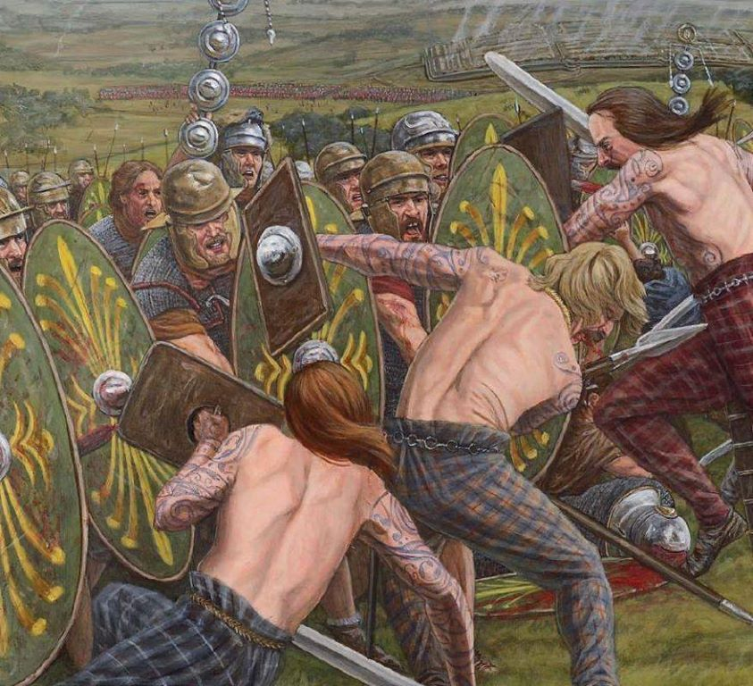

<link rel="stylesheet" href="custome/style.css">

# ⚔ Intelligent Formation Simulation Language (IFSL) ⚔

## Indice:

1. [Idea General](#div-classheader1-idea-generaldiv)

2. [Mundo Simulado](#div-classheader1⚔-mundo-simuladodiv)

3. [Unidades de ejercito](#div-classheader1⚔-unidades-de-ejercitodiv)

4. [Resumiendo y formalizando](#div-classheader1⚔-resumiendo-y-formalizandodiv)

## 
⚔ Idea General

&nbsp; El proyecto tiene como objetivo principal poder simular batallas entre ejercitos en un mapa bidimensional usando un Domain-Specific Language con un enfoque recursivo para que usuarios no familiarizados a profundidad con la programación puedan definir formaciones, transiciones entre formaciones e incluso definir con cierto grado de libertad todo el comportamiento de un ejercito, de forma tal que se puedan desarrollar por su cuenta en una simulación.

&nbsp; Para probar su funcionamiento se presentará un ejemplo de cómo debería usarse en un encuentro entre 2 equipos que se enfrentan en una batalla con el objetivo de vencer a su oponente para adueñarse del territorio, ya sea destruyendo estructuras o cortando comunicaciones del equipo contrario. Cada uno inicialmente cuenta con una determinada cantidad de unidades con las cuales deben desarrollar las estrategias de la guerra, cada unidad es capaz de interactuar con otras unidades y con el entorno. De igual modo cada unidad tiene una serie de reglas que rigen dichas interacciones para una mayor semejanza con las acciones desarrolladas en un combate real. Se sacará una valoración de que tan bueno es un equipo con respecto al otro al terminada la simulación, esto nos permitirá compararlos para mejorar su comportamiento en las situaciones específicas al comienzo de la simulación.

## 
⚔ Mundo Simulado

  
&nbsp; El desarrollo de la simulación de batalla se centra en una porción cuadrada de terreno en un mundo X, dicha porción está dividida en casillas (a modo grid) donde se pueden posicionar elementos del mundo tales como: Rios, Cesped, Árboles frutales, Montañas y Unidades. Inicialmente cada unidad de los ejércitos conoce la ubicación de todos los elementos del mapa excepto por la ubicación de las unidades del ejército adversario.

&nbsp; Los ejércitos tambien van a tener al clima como un obstáculo, tal y como puede suceder en una verdadera disputa de territorios, se tendrán factores climatológicos que frenaran el avance de las tropas.
  
&nbsp; Las unidades podrán interactuar con elementos del sistema o con otras unidades, las distintas funciones a realizar sobre cada uno de estos se especificarán en su estrategia.

**Interacciones unidad-entorno**

- Esquivar montañas.
- Cruzar rios.
- Ocultarse en el cesped.

**Interacciones unidad-unidad**

- Comunicar información a unidades de su mismo ejército [usando una radio que portan todas las unidades].
- Atacar a unidades del ejército enemigo.
  
&nbsp; La forma de medir el tiempo que ha transcurrido en cada instante desde la posicion inicial de las unidades en el tablero hasta que uno de los ejércitos se proclame vencedor es importante, pero medir el tiempo de forma continua no es factible, por tanto estableceremos un sistema de rondas. En una ronda cada ejército ejecutará una accion por cada una de las unidades que tenga aun con vida. Estableceremos entonces que las acciones realizadas durante una ronda es el equivalente a 2 horas en tiempo real, por lo que tras 12 rondas se habrá completado todo un dia de actividad.

## 
⚔ Unidades de ejercito

&nbsp; En la batalla van a participar distintos tipos de unidades todos con características distintas (velocidad, poder de ataque, alcance, ...) y la propiedad fundamental que cumplen estos tipos de unidades es que todos tienen al menos otro tipo de unidad al que son débiles; por esta razón uno de los factores más decisivos en una batalla son las formaciones y las transiciones entre ellas.

&nbsp; Los agentes tiene control sobre un conjunto de unidades y buscan destruir la base del contrario. La base es una unidad inmovil situada en un lugar del mapa desconocido por el oponente la cual va a "generar" una cantidad finita de unidades definida desde el inicio del juego. La generación va a realizarse en demanda del agente que le corresponde la base y esta va a demorar una cantidad de turnos en producirse la cual va a depender del tipo de unidad a generar.

&nbsp; La información de cada agente es la que pueda obtener de cada uno de sus soldados. Esta consiste principalmente en los enemigos y tipos de enemigos que se avistan dentro de un rango el cual depende del tipo de soldado que está observando, por lo que se considera un caso de parcialmente observable. Esta vista puede estar obstruida por obstáculos del mapa. Cada agente decide en cada turno la acción que va a realizar cada una de sus unidades durante el mismo, las cuales van a ser generalemente atacar a una casilla o moverse a una casilla.

Los turnos se van a dividir en 3 momentos:
 1) la decisión de lo que se va a hacer
 2) se efectuan los movimientos 
 3) se realizan los ataques

&nbsp; Los movimientos se pueden realizar a una de las 8 casillas adyacentes, siempre que estén vacías, en dependencia de un costo de movimiento asociado a tipo de unidad que lo está realizando. Este costo de movimiento va a estar representado por la cantidad de turnos necesarios para que una unidad se mueva a una casilla adyacente. También se pueden intercambiar posiciones con una unidad aliada adyacente, intercambio que tendrá un costo de movimiento igual al máximo del costo de movimiento de la unidades que participan. El movimiento se puede cancelar durante el período que demora su realización. Si ocurre que en el turno donde una unidad A le corresponde cambiar de posición, esta posición está ocupada por otra unidad B, entonces este movimiento solo se realizará si también es el turno donde la unidad B se tiene que cambiar de posición y su nueva posición no es la que tenía originalmente la unidad A.

&nbsp; Los ataques tienen asociado un daño y un alcance en dependencia del tipo de unidad. Si una unidad decide atacar a otra unidad que se encuentra en movimiento entonces el ataque va a ser efectivo con una probabilidad de:

 $$ \frac{c_{atacado}}{c_{atacante} + c_{atacado}} $$

&nbsp; Donde $c$ es la costo de movimiento. La debilidad de ciertos tipos frente a otros va a estar representada por un factor que va a multiplicarse al daño del atacante en caso de que el ataque sea sobre un tipo que sea debil a sus ataques.

## 
⚔ Resumiendo y formalizando

En resumen del problema se tiene:

> **Estado inicial:**
>
>- Mapa con los elementos del entorno y las unidades de cada ejército agrupadas en lugares alejados del terreno.
>
> **Entidades (Jugadores):**
>
>- Las n unidades de cada ejército.(2n unidades en total).
>
>**Acciones:**
>
>- Cada unidad puede hacer solo una de las acciones posibles según su estado.
>
>**Finalización:**
>
>- Se finaliza la guerra cuando uno de los ejércitos es derrotado (pierde todas sus unidades).

